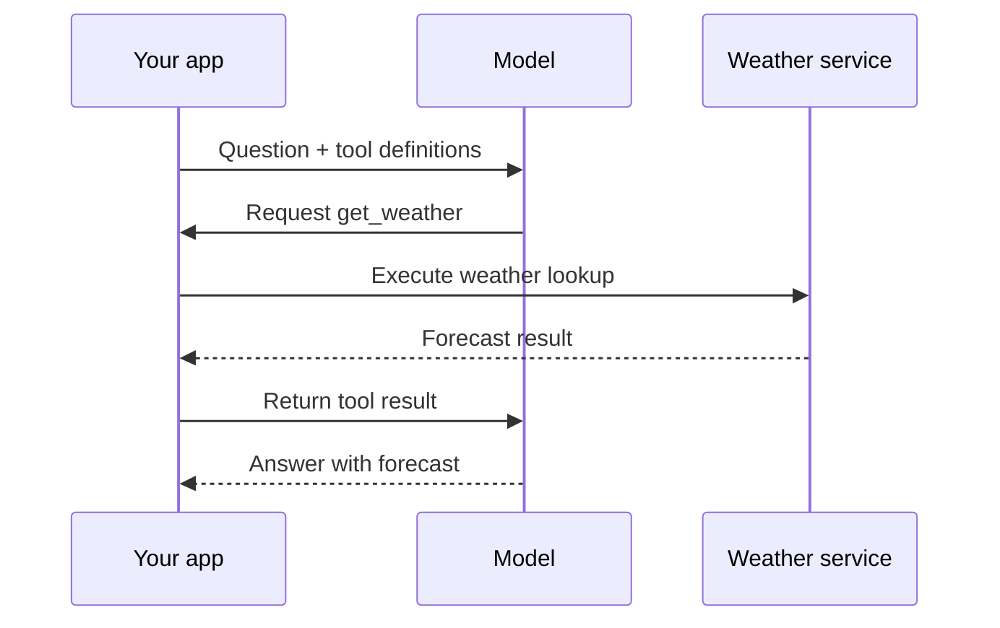
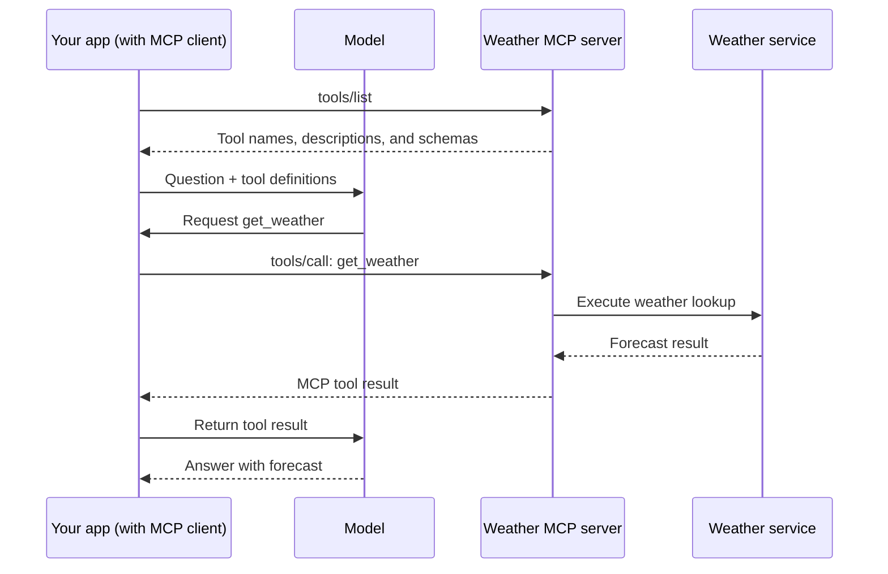

Model Context Protocol has had an incredible run over the past two years. If you build software (or just use it), you've no doubt heard about MCP. You may have connected an agent like `Claude Code to an MCP server to give it new abilities.

Many videos and posts describe the _what_ of MCP, and the reasons it's exciting. But developers I talk to are often confused about the _why_ and _how_: Is MCP just a special kind of API? Why do we need a new API for agents, anyway? Can't agents just call regular APIs? Why does MCP drag OAuth and all its jargon into the picture?

In this post, I'll break down the _why_ and _how_ of MCP in plain English. You don't need to have a background in agents or models to follow along.

**TL;DR** — Because of how they work, AI models (LLMs) need an API to reach the outside world via your application code. MCP standardizes how _your application code_ does this, so you can reuse integrations instead of writing each one yourself.


## The clever intern in a strange office

Imagine that you hire a new intern or junior employee to help you with your work. They are smart, have a great education, and can write very well. There's just one catch: for reasons that will become clear soon, they work in a very strange office. The intern works in a windowless room and can't access the internet or talk on the phone. They have a lot of knowledge in their head, but they don't have access to a library to look things up or learn new pieces of information.

In fact, the _only_ thing the intern can do is answer written notes that you slip under the door. Send a note under the door with a question or task, and the intern reads it and pushes their written response back under the same door.

You might think: With so many limitations, is this even useful at all?

As it turns out, somewhat useful! The intern is very good at writing, so even without internet access you can ask them to check your writing for typos, change the tone of an email, or summarize a long document for you. Useful but still limited.

Now, let's push the limits a little. Suppose you ask the intern a question involving your company's financials:

```
Kevin Flynn (you):

Help me calculate my profit.

Revenue   $129,655
Costs     $104,009

Profit or loss?
```

It would be ideal if you could sneak a calculator under the door too, but unfortunately only a thin sheet of paper will fit. Without a calculator, the intern must do math in their head. That might work for small numbers, but even the best mental mathematician will make mistakes when the numbers get big or plentiful enough.

So you find a clever workaround. Written words are the only thing that can pass back and forth, so you write:

```
Kevin Flynn (you):

If you need a calculator, send me a note back with
CALC(expression)

For example, CALC(1 + 1)

Revenue   $129,655
Costs     $104,009

Profit or loss?
```

You still can't fit a calculator under the door, but the intern can ask to use a calculator by writing down what they want to calculate.

```
Intern:

CALC(129655 - 104009)
```

Now it's up to you to use a real calculator and send the result back again:

```
Kevin Flynn (you):

If you need a calculator, send me a note back with
CALC(expression)

For example, CALC(1 + 1)

Revenue   $129,655
Costs     $104,009

Profit or loss?


Intern:
CALC(129655 - 104009)


You:
Result: 25646
```

Now the intern can finally answer the question:

```
Intern:

You are turning a profit of about $25.6K.
```


In the mid-20s, LLMs became very good at writing text. They are trained on text, and can input and output text (and sometimes images). Generating a text response does not, by itself, look up a forecast or send an email. For that, the model needs software outside it to carry out an action.

The pattern I'm describing here is called **tool calling**. It's a pattern most LLMs are explicitly trained on: you tell the model what tools (functions) are available, and the model can write text indicating it wants to call one of those tools. The model writes a request to run the tool or function; the surrounding software executes it.

## Tut tut, it looks like rain

Let's look at a real example using the OpenAI Responses API and GPT-5.6 Terra. This is what calling the GPT-5.6 API looks like:

```http
POST https://api.openai.com/v1/responses
Content-Type: application/json
Authorization: Bearer $OPENAI_API_KEY

{
  "model": "gpt-5.6-terra",
  "input": "What will the weather be tomorrow in Buenos Aires?"
}
```

By default, you might get a response like this:

```json
{
  "output": [
    {
      "type": "message",
      "role": "assistant",
      "content": [
        {
          "type": "output_text",
          "text": "I can't access live weather forecasts. Check a weather service for tomorrow's Buenos Aires forecast."
        }
      ]
    }
  ]
}
```

The intern in the strange office is smart and may have learned what the weather _tends_ to be like in Buenos Aires, but it has no way of knowing tomorrow's forecast. A model might also guess (hallucinate) instead of admitting that limitation; either way, it hasn't looked anything up.

Unless we give it a way to _ask_ for a weather lookup:

```http
POST https://api.openai.com/v1/responses
Content-Type: application/json
Authorization: Bearer $OPENAI_API_KEY

{
  "model": "gpt-5.6-terra",
  "input": "What will the weather be tomorrow in Buenos Aires?",
  "tools": [
    {
      "type": "function",
      "name": "get_weather",
      "description": "Get tomorrow's forecast for a city, using that city's local date.",
      "strict": true,
      "parameters": {
        "type": "object",
        "properties": {
          "city": { "type": "string" }
        },
        "required": ["city"],
        "additionalProperties": false
      }
    }
  ]
}
```

The `tools` field is our note saying, "If you need a weather lookup, ask me." We describe the function and its arguments - in other words, the _interface_ but not the code of the function itself.

Now the model's response can ask for a function call:

```json
{
  "id": "resp_weather_1",
  "output": [
    {
      "type": "function_call",
      "call_id": "call_weather_1",
      "name": "get_weather",
      "arguments": "{\"city\":\"Buenos Aires\"}"
    }
  ]
}
```

The model can't actually run `get_weather`, so your application code must call the actual weather lookup code and send the result back. Here's that follow-up request:

```http
POST https://api.openai.com/v1/responses
Content-Type: application/json
Authorization: Bearer $OPENAI_API_KEY

{
  "model": "gpt-5.6-terra",
  "previous_response_id": "resp_weather_1",
  "input": [
    {
      "type": "function_call_output",
      "call_id": "call_weather_1",
      "output": "Tomorrow in Buenos Aires: rain, with a high of 18°C."
    }
  ]
}
```

`previous_response_id` continues the earlier conversation, and `call_id` matches the result to the requested call. The model can now generate the final answer:

```json
{
  "output": [
    {
      "type": "message",
      "role": "assistant",
      "content": [
        {
          "type": "output_text",
          "text": "Tomorrow in Buenos Aires, the forecast calls for rain with a high of 18°C. Bring an umbrella!"
        }
      ]
    }
  ]
}
```

That's the [tool calling pattern](https://developers.openai.com/api/docs/guides/function-calling): describe a tool, allow the model to request it, execute the function, and return the result. For the visual learners, here's the round trip:



You might wonder: Why can I ask ChatGPT (the application) for the weather and get a real answer, while the API request above to the same model can't answer?

It's the same model under the hood, but the difference is the application _around_ the model. The model is still like the intern in the strange office. The application and code around the model is what gives the model abilities beyond writing text.

## More tools, more problems

Once you understand this pattern, why stop at a calculator or weather forecast? You can give your intern a whole menu:

```text
web_search(query)
get_calendar(date)
read_file(path)
send_email(to, subject, body)
```

Now you can ask for something like, "Check tomorrow's meetings and help me prepare." The model might ask for your calendar, read a file mentioned in a meeting, then search for background information.

Let the model request tools, execute those requests, and feed the results back in a loop, and you've built the core of what people often call an **agent**.

Suppose this works really well. You have five functions, then fifty. Other teams want to consume them, and other companies want to provide them. Many weather services already have great APIs, so all you need is some glue to adapt the API to the tool calling pattern: a description of the function and its arguments, so the model can understand how to use it, and code that executes the real request inside your application.

Once you write that glue code once or twice, the cranky engineer part of your brain will likely scream "Don't Repeat Yourself!"

It sure would be useful if everyone agreed on a common interface for this...

## MCP is a standard interface

That's exactly what MCP is: a [standardized](https://modelcontextprotocol.io/docs/2026-07-28/learn/architecture) way for AI applications to plug and play capabilities that fit well into the tool calling pattern. It's intentionally boring: no AI magic required.

Let's look at the weather example again, but introduce an MCP client. An MCP client is the part of your application that talks to an MCP server:



From the model's point of view, nothing has changed. The model still only sees the `get_weather` tool. The MCP conversation happens between the application and the MCP server. You can use the same interface to connect a calculator, weather service, or calendar integration - it all works basically the same way.

Note that tools aren't the only thing MCP can do! But I find that they're the easiest thing to understand as an introduction to MCP.

## Conclusion

Behind the hype, MCP is a story about standardizing an API pattern. It's kind of boring, and that's a _good_ thing. AI models are powerful and changing quickly, but many of the problems _around_ the model are familiar software development problems: calling APIs, avoiding duplicate work, and making separate systems interoperate.

As for why MCP adopted OAuth and all its jargon into the picture, I'll cover that in the next post. ☕️
